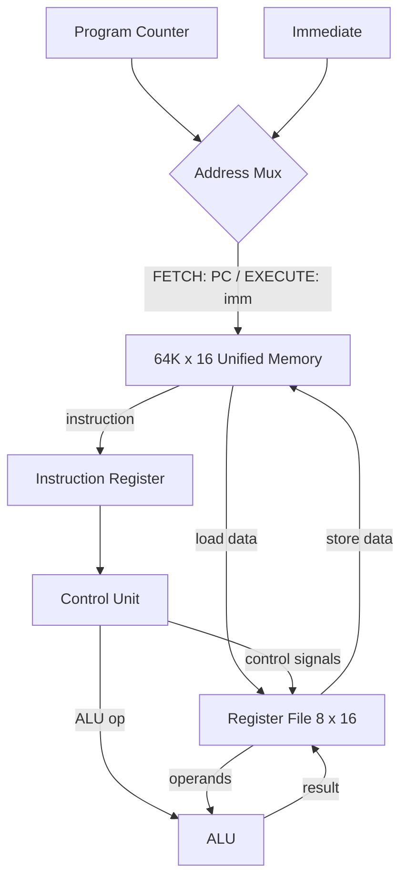

# Simple-CPU


A simple 16-bit CPU written in Verilog, built as a learning project. Von Neumann
design with a 16-bit datapath, eight general-purpose registers, a custom 15-instruction
ISA, and a self-checking testbench.

This project demonstrates:
- **A custom 16-bit ISA**: 4-bit opcodes with register-register arithmetic, load-immediate, memory load/store, unconditional and conditional jumps, and halt
- **A two-phase fetch/execute cycle**: the single memory port is shared, serving instruction fetch in one cycle and data access in the next
- **A modular datapath**: ALU, register file, control unit, and memory as separate, individually readable modules
- **Correct RTL discipline**: non-blocking assignments in the clocked FSM, blocking assignments in the combinational decoders
- **A self-checking testbench**: verifies the register file and memory contents after the program halts, with a watchdog so a hung CPU fails instead of running forever

## Table of Contents
- [Architecture](#architecture)
- [Instruction Set](#instruction-set)
- [Repository Structure](#repository-structure)
- [Build and Run](#build-and-run)
- [Design Notes](#design-notes)
- [License](#license)

## Architecture


Each instruction takes two clock cycles: **FETCH** drives the memory address with the
PC and latches the instruction, **EXECUTE** drives it with the immediate for data
access, performs the ALU operation, writes back, and updates the PC.

## Instruction Set
4-bit opcode in `[15:12]`, 3-bit register fields, 9-bit immediate for LOAD/LDM/STORE/JZ/JNZ.

| Mnemonic | Opcode | Format | Effect |
|----------|--------|--------|--------|
| LOAD | `0001` | `LOAD Rd, imm` | Rd = imm (load immediate) |
| ADD | `0010` | `ADD Rd, Rs1, Rs2` | Rd = Rs1 + Rs2 |
| STORE | `0011` | `STORE Rs, addr` | mem[addr] = Rs |
| SUB | `0100` | `SUB Rd, Rs1, Rs2` | Rd = Rs1 - Rs2 |
| MUL | `0101` | `MUL Rd, Rs1, Rs2` | Rd = Rs1 * Rs2 |
| DIV | `0110` | `DIV Rd, Rs1, Rs2` | Rd = Rs1 / Rs2 |
| AND | `0111` | `AND Rd, Rs1, Rs2` | Rd = Rs1 & Rs2 |
| OR | `1000` | `OR Rd, Rs1, Rs2` | Rd = Rs1 \| Rs2 |
| NOT | `1001` | `NOT Rd, Rs1` | Rd = ~Rs1 |
| XOR | `1010` | `XOR Rd, Rs1, Rs2` | Rd = Rs1 ^ Rs2 |
| JUMP | `1011` | `JUMP addr` | PC = addr |
| LDM | `1100` | `LDM Rd, addr` | Rd = mem[addr] (load from memory) |
| JZ | `1101` | `JZ Rs, addr` | if (Rs == 0) PC = addr |
| JNZ | `1110` | `JNZ Rs, addr` | if (Rs != 0) PC = addr |
| HALT | `1111` | `HALT` | stop execution |

## Repository Structure
```
.
├── cpu.v               # Top level: PC, IR, fetch/execute FSM, module wiring
├── alu.v               # Arithmetic/logic unit
├── control_unit.v      # Instruction decoder and control signals
├── register_file.v     # 8 x 16-bit register file
├── memory.v            # 64K x 16 unified memory, loaded from hex
├── cpu_tb.v            # Self-checking testbench with watchdog
├── program.hex         # Demo program (arithmetic, memory, jump, countdown loop)
├── 📄 README.md        # This documentation
├── 📄 .gitignore       # Ignores the sim binary and waveforms
└── 📄 LICENSE          # MIT License
```

## Build and Run
Requires [Icarus Verilog](https://steveicarus.github.io/iverilog/).

```bash
iverilog -o sim cpu_tb.v cpu.v alu.v control_unit.v memory.v register_file.v
vvp sim
```

Expected output (the demo program adds 10 and 11, round-trips the sum through
memory, jumps over a LOAD that must not execute, runs a countdown loop closed
by JNZ, and finishes with a JZ taken at zero):
```
Test passed: arithmetic, memory, JUMP, and a JNZ-closed loop of exactly 3 iterations with JZ taken at zero
```

## Design Notes
- The memory has a single port, so fetch and data access are time-multiplexed by the
  two-phase FSM. Register and memory writes are gated to the EXECUTE phase.
- Register write-back is muxed by `mem_to_reg`: LDM writes memory data, everything
  else writes the ALU result. LOAD (immediate) never touches memory; the immediate
  passes through the ALU's MOV operation.
- The control unit maps instruction opcodes to the ALU's internal operation encoding;
  the two encodings are intentionally decoupled.
- JZ/JNZ reuse the ALU: the tested register is ORed with itself, so the zero flag
  reflects its value and no separate comparator is needed. A taken branch loads the
  9-bit immediate into the PC.
- Divide-by-zero is defined to return 0 rather than propagate x through the datapath.
- The memory read bus drives 0 when idle instead of high-impedance, so the design
  contains no internal tri-state and stays synthesizable.
- The testbench checks architectural state (register file and memory) rather than
  transient datapath signals, and a watchdog timer makes a hung simulation fail loudly.

## License
MIT License. See [LICENSE](LICENSE) for details.
